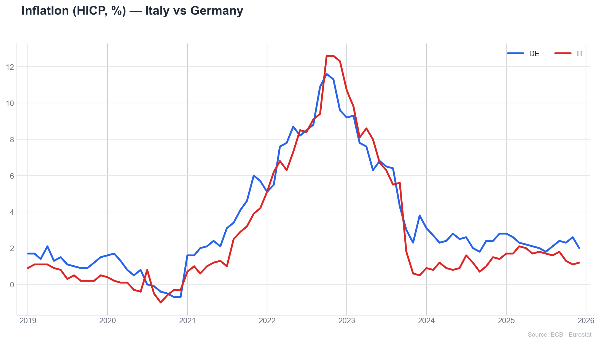
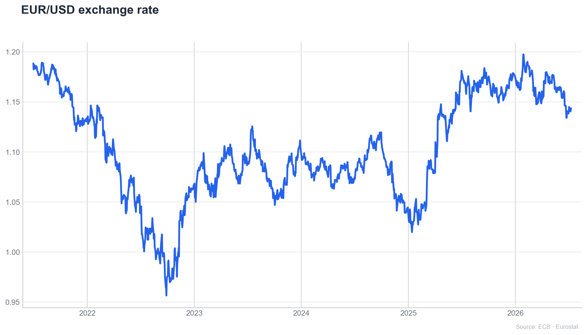
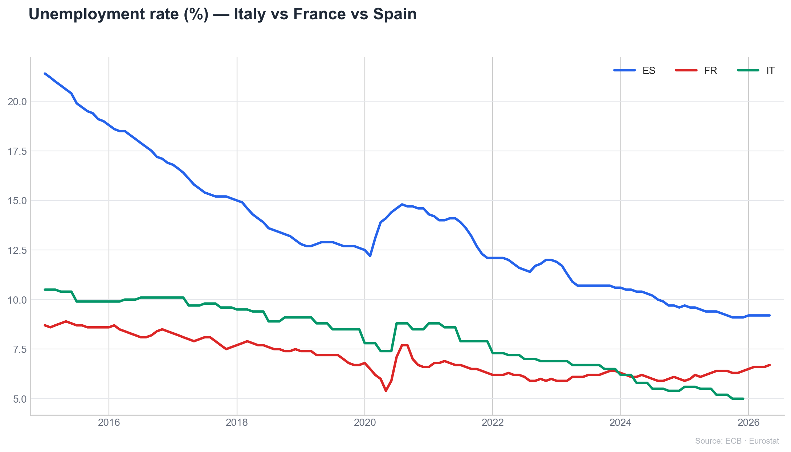

# EU Analytics Bot

**Natural-language access to official European statistics — ask in plain language and get
a rigorous chart from live ECB and Eurostat data, plus a written analysis, in seconds.**


> _"Inflation Italy vs Germany since 2020"_ · _"Disoccupazione Francia Spagna"_ ·
> _"EUR/USD exchange rate"_ · _"/search tourism nights"_

Author: **Giulio Albano** — University of Bari (UNIBA), PhD in Economics and Finance of
Public Administrations.

---

**Live demo — inflation, Italy vs Germany, straight from ECB & Eurostat:**



**Contents:** [Why it matters](#why-it-matters) · [What it can answer](#what-it-can-answer) ·
[Pipeline](#how-it-works--the-pipeline) · [Data sources](#data-sources) ·
[Engineering](#engineering-highlights) · [Architecture](#architecture) ·
[Setup](#setup) · [Usage](#usage)

## Why it matters

The European Central Bank and Eurostat publish an enormous amount of macroeconomic and
financial data through the **SDMX** standard — but reaching a specific series normally
means knowing dataset codes, dimension keys and API formats. This bot removes that barrier:
anyone can ask a question in ordinary Italian or English and receive a clean, sourced
chart with a short analysis.

**Methodological principle (the important part).** The language model *never produces the
numbers*. It only turns the question into a **structured query** — provider, dataset,
series key, country, time window — which is then executed against the official ECB/Eurostat
APIs. Every figure shown is the exact published value, traceable to source. The AI decides
*what to fetch and how to display it*; the institutions provide *the data*.

## What it can answer

**Compare countries over time** — one clean line per country, live from the source. The
inflation chart above is exactly this: two countries, one question.

**Track markets and rates** — exchange rates, policy rates, yields, monetary aggregates.



**Mix ECB and Eurostat indicators** — inflation, unemployment, GDP, debt, house prices,
labour cost, bond yields, and more.



Plus: **regional (NUTS-2)** queries, and a **`/search` command that reaches ANY of Eurostat's
~9,000 datasets** — not just a curated list — charting a result on tap. Every answer carries
a short GPT commentary (headline, insights, bottom line) with a numeric fallback.

## How it works — the pipeline

```
user message
   │
   ▼  1. route              detect indicator, countries/regions, time window, intent
   ▼  2. structured plan    build a provider + dataset/series query (ECB SDMX or Eurostat)
   │                          — country-aware ECB series, EA↔country handling, period parsing
   ▼  3. fetch              call the official API; one series per requested geography
   │                          (ecbdata / SDMX-JSON for ECB, JSON-stat for Eurostat)
   ▼  4. normalise          decode to a tidy [TIME_PERIOD, OBS_VALUE, COUNTRY] frame,
   │                          apply the requested window, retry on transient failures
   ▼  5. render             Matplotlib time series (one line per country)
   ▼  6. commentary         GPT writes a short, grounded analysis (numbers only)
   ▼
 reply (chart + text)
```

## Data sources

| Provider | Examples | Access |
|---|---|---|
| **ECB Data Portal** | inflation (HICP), policy & deposit rates, yield curve, money supply, loans, exchange rates | SDMX 2.1 REST / `ecbdata` |
| **Eurostat** | unemployment, employment, GDP growth, government debt & deficit, house prices, labour cost, long-term bond yields, population — and any dataset via `/search` | SDMX 2.1 REST (JSON-stat) |

Both expose data via the SDMX standard. ECB series are `FLOW.KEY`
(e.g. `ICP.M.U2.N.000000.4.ANR`); Eurostat datasets are queried by id with dimension filters
and decoded from JSON-stat.

## Engineering highlights

- **Search ANY Eurostat dataset.** `/search <keywords>` browses the full Eurostat catalogue
  (cached locally) and fetches a result by id, with automatic single-series selection — the
  whole 9,000-dataset corpus, not a hardcoded shortlist.
- **Correct JSON-stat decoding.** Eurostat's sparse, row-major value arrays are decoded from
  `id`/`size` — a subtle step that, done wrong, silently misaligns time and value on
  multi-dimension datasets.
- **Country-aware ECB series.** The bot rewrites ECB series keys per country where the flow
  supports it (e.g. inflation ICP), and handles the euro-area ↔ member-state distinction.
- **Multi-country comparison** modelled as one series per geography, concatenated and pivoted
  — so a two-country question becomes a two-line chart.
- **Robustness.** UTF-8 output, per-request backoff retries against transient API errors, a
  cache keyed by series *and* period, and a graceful "I couldn't map that" hint for
  unrecognised queries.

## Architecture

```
main.py                          entry point (starts Telegram polling)
modules/
  telegram_bot.py                commands, menus, multi-geo orchestration, /search
  llm_router.py                  message → structured query plan
  ai_parser.py                   indicator catalog, EN/IT synonyms, country/region/period
  fetchers/ecb_adapter.py        ECB fetch + normalization (ecbdata + REST fallback)
  fetchers/eurostat_adapter.py   Eurostat fetch + JSON-stat decode
  eurostat_search.py             catalogue search + fetch-any-dataset
  plotter.py                     Matplotlib time series
  data_commenter.py              GPT or numeric commentary, provider-aware citation
```

## Setup

Requires Python 3.10+.

```bash
python -m venv .venv
# Windows:  .venv\Scripts\activate  ·  macOS/Linux:  source .venv/bin/activate
pip install -r requirements.txt
```

Configuration via `.env` (see `.env.example`):

| Variable | Required | Purpose |
|---|---|---|
| `TELEGRAM_TOKEN` | ✅ | BotFather token |
| `OPENAI_API_KEY` | optional | Enables GPT commentary and fuzzy indicator routing |

The real `.env` is git-ignored — never commit tokens.

## Run

```bash
python main.py
```

## Usage

```
Inflation Euro area since 2020
Inflation Italy vs Germany since 2020        # comparison → two lines
Disoccupazione Francia Spagna                # Italian
GDP per capita Euro area
EUR/USD exchange rate
/search life expectancy                      # any Eurostat dataset
```

## Limits & notes

- ECB per-country series exist only where the flow supports it; ECB GDP (MNA) stays euro-area —
  use Eurostat GDP for country breakdowns.
- `/search` picks a single representative series per dataset; a dimension-filter UI is the
  natural next step.
- GPT usage incurs cost; validate and monitor your key.

## Attribution

Data: ECB Data Portal and Eurostat (both CC BY 4.0). Built with `aiogram`, pandas, matplotlib,
and the `ecbdata` client.
